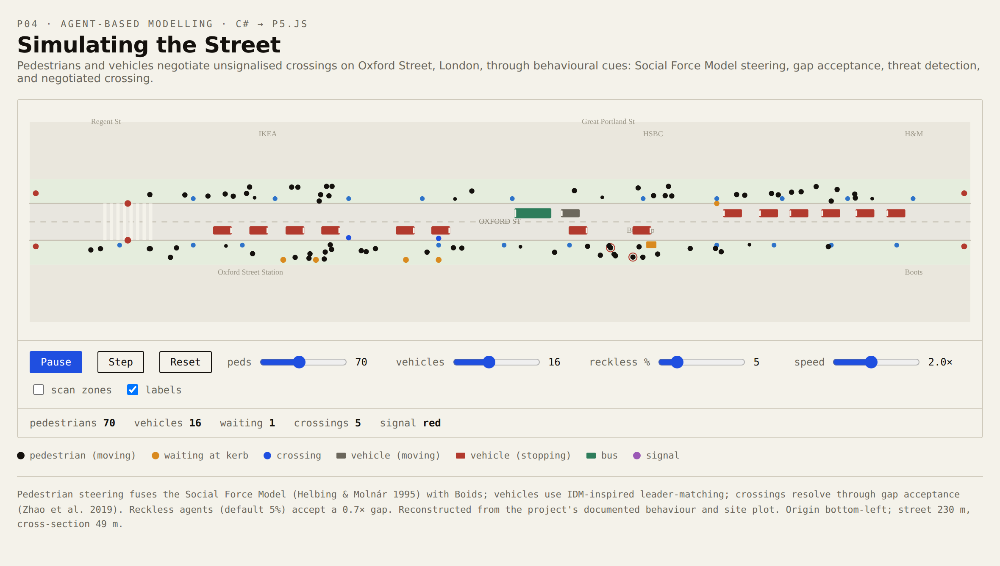

# Simulating the Street

Agent-based pedestrian and vehicle simulation of Oxford Street, London, running live in the browser.

## [▶ Live demo](https://taishobuya.github.io/Simulating-the-Street/)

## What it does

Pedestrians and vehicles share a 230 m stretch of Oxford Street and negotiate right of way at unsignalised crossings.

- Pedestrian steering fuses a Social Force Model (Helbing and Molnar 1995) with Boids flocking behaviour.
- Vehicles use IDM-inspired leader-matching (Treiber et al. 2000): a vehicle scans the lane ahead and matches the speed of a slower leader.
- Crossing is resolved through gap acceptance (Zhao et al. 2019): a pedestrian at the kerb steps out only when no vehicle is within the scan distance.

Each agent is a finite state machine. Pedestrians move through Spawn, Moving, Waiting, Crossing and Despawn; vehicles move through Spawn, Moving, Waiting, Stopping and Despawn. The two machines read each other at the kerb, so a stopping vehicle promotes a waiting pedestrian to crossing.

## Parameters

| Parameter | Value |
| --- | --- |
| Vehicle speed | 8 to 9 m/s (20 mph limit) |
| Pedestrian speed | 1.0 to 1.5 m/s (mean 1.25 m/s) |
| Crossing scan distance | 20 m |
| Vehicle scan | 20 m forward rectangle, plus or minus 3 m |
| Reckless agents | 5 percent, using 0.7 times the normal scan range |

## Two implementations

**Original: Grasshopper C#**, in [`original-grasshopper/`](original-grasshopper/). The simulation was first built as a C# scripting component inside a Grasshopper definition for Rhino 3D. The C# file is the core agent logic inside that definition; it is not a standalone program and depends on other components on the Grasshopper canvas for its inputs and display. Anyone with Rhino and Grasshopper can open the `.gh` file to run the original.

**Browser port: p5.js / JavaScript**, self-contained in a single HTML file at the root of this repository and deployed on GitHub Pages. This is the runnable version for anyone without Rhino, at the live demo link above.

## Context

Built as a project for BARC0034 Morphogenetic Programming, MSc Architectural Computation, UCL, 2025-26.

## Author

Tai Shobuya · [taishobuya@gmail.com](mailto:taishobuya@gmail.com) · [linkedin.com/in/tai-shobuya](https://www.linkedin.com/in/tai-shobuya)
